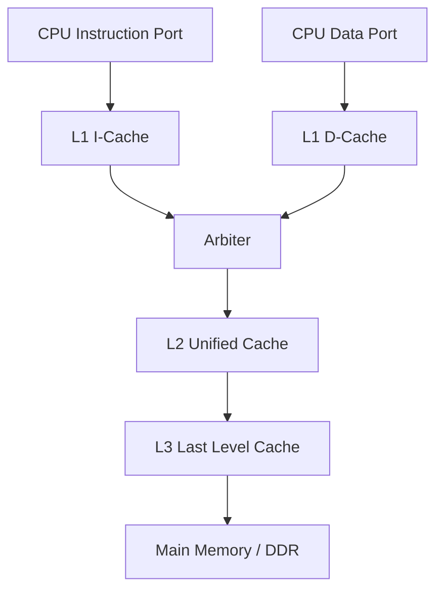

[](https://en.wikipedia.org/wiki/SystemVerilog) [](https://www.python.org/) [](https://www.xilinx.com/products/design-tools/vivado.html) [](http://iverilog.icarus.com/) [](https://opensource.org/licenses/MIT)

# Hierarchical Cache System (L1/L2/L3)

A modular 3-level cache memory subsystem written in SystemVerilog. This project implements a fully synthesizable memory hierarchy featuring split L1 I/D caches, centralized L2, and Last-Level L3 cache, using a simple transactional interface.

---

## Key Features
*   **Modular Architecture**: Plug-and-play components for L1, L2, L3, and Arbiters.
*   **Synthesizable Design**: optimized for FPGA (Vivado) and ASIC flows.
*   **Configurable**: Parameters for Cache Size, Associativity, and Line Size.
*   **Standard Interface**: Simple Request/Ready/Valid handshake protocol (similar to AXI-Lite).
*   **Coherence Support**: Includes framework for MESI/MOESI (Basic Write-Back/Write-Allocate implemented).

## System Architecture



## Quick Links
*   [Getting Started](docs/GETTING_STARTED.md) - Simulation and Synthesis instructions.
*   [Interface Spec](docs/INTERFACE.md) - Signal definitions and Protocol details.
*   [Architecture](docs/ARCHITECTURE.md) - Deep dive into internal FSMs and Tag Arrays.
*   [Verification Report](docs/VERIFICATION.md) - Latest simulation results and test coverage.

## Usage
This module is designed to be treated as a Black Box IP.

```systemverilog
hierarchical_cache_top u_cache_sys (
    .clk(system_clk),
    .rst_n(system_rst_n),
    .cpu_l1i_req_i(instr_bus_req),
    .cpu_l1i_resp_o(instr_bus_resp),
    .cpu_l1d_req_i(data_bus_req),
    .cpu_l1d_resp_o(data_bus_resp),
    .mem_req_o(ddr_req),
    .mem_resp_i(ddr_resp)
);
```

## Quick Start (Icarus Verilog)
This project is optimized for Icarus Verilog compatibility. We provide a concatenation script to simplify simulation with multi-file SystemVerilog projects.

1.  **Prepare Files**:
    ```powershell
    python concat.py
    ```
2.  **Compile**:
    ```powershell
    iverilog -g2012 -s tb_hierarchical_cache -o sim.vvp all_in_one.sv
    ```
3.  **Run**:
    ```powershell
    vvp sim.vvp
    ```

## Synthesis
Verified with Xilinx Vivado. The design uses standard SystemVerilog constructs and is ready for FPGA/ASIC implementation.
Run `scripts/run_vivado_synth.tcl` to validate.

---
*Maintained by [Rickarya Das](https://github.com/ridash2005)*
