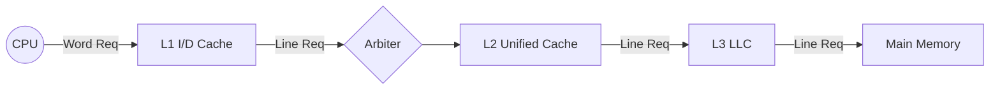
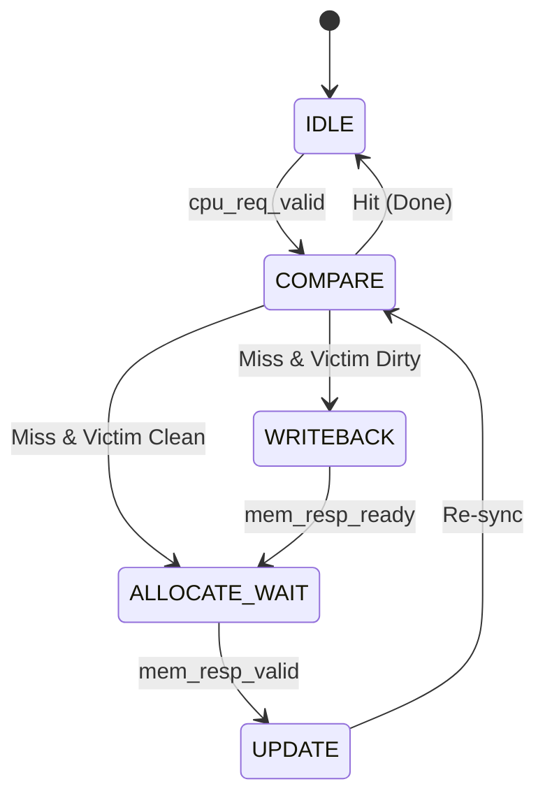
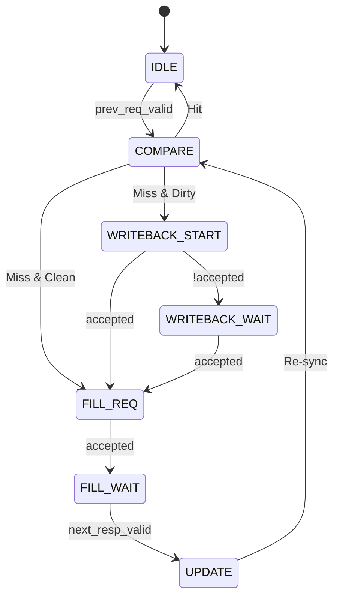
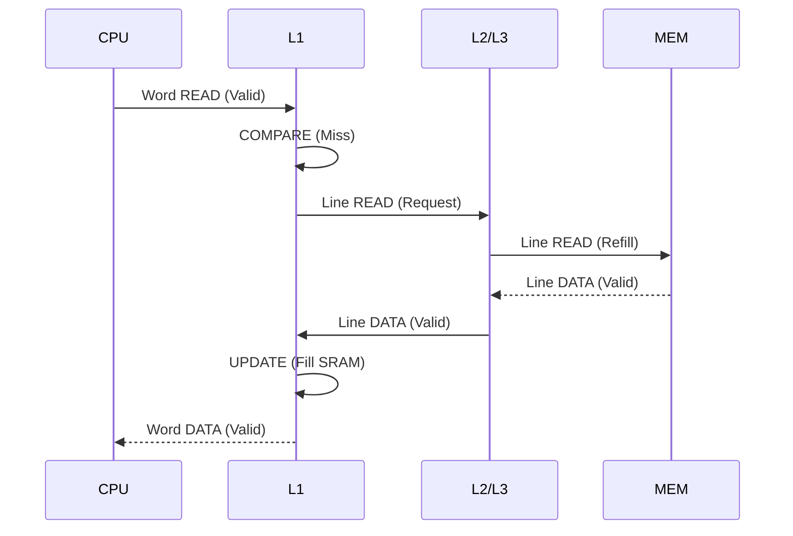

# Architectural Specification

## Overview
The Hierarchical Cache Design provides a 3-level memory hierarchy to bridge the latency gap between a high-speed CPU and off-chip DRAM.

## Microarchitecture
### L1 Cache (Instruction & Data)
- **Parameters**: 32KB per cache, 4-Way Set Associative.
- **Write Policy**: Write-Back, Write-Allocate.
- **Replacement**: Pseudo-LRU (Counter-based Victim Selection).
  - `UPDATE`: Post-refill synchronization cycle to allow SRAM output to settle before re-comparing.

#### L1 FSM Visualization

- **FSM States**: `IDLE`, `COMPARE`, `WRITEBACK_START` (Wait for Grant), `WRITEBACK_WAIT` (Wait for ACK), `FILL_REQ`, `FILL_WAIT`, `UPDATE`.

#### Unified FSM Visualization

### L3 Cache (LLC)
- **Parameters**: 8MB (8192KB).
- **Role**: Last Level Cache interacting with Main Memory. Uses the same unified cache microarchitecture as L2.

## Data Structures
Each Cache Way consists of two SRAM arrays:
1.  **Tag Array**: Stores Tag bits, Valid bit, and Dirty bit.
    - Width = `TAG_WIDTH + 2`
2.  **Data Array**: Stores the entire Cache Line.
    - Width = `CACHE_LINE_SIZE` (512 bits)
    - *Future Optimization*: Split Loop for Byte Enable or Banked Architecture.

## Interface Protocol
For maximum tool compatibility (specifically **Icarus Verilog**), the hardware uses **Packed Structs** (`cache_req_t` and `cache_resp_t`) for all inter-module communication.

- **Request Channel**: Master drives `addr`, `data`, `line_data`, `cmd`, `valid`, `is_burst`.
- **Response Channel**: Slave drives `ready` (acceptance), `valid` (data return), `data`, `line_data`, `error`.

Modules unroll these structs into local logic signals within their `always` blocks to avoid simulator-specific limitations with direct struct member indexing.

## Transaction Flow (Read Miss Example)

## Synthesis Notes
- **SRAM**: Inferred as Distributed RAM or Block RAM depending on size and tool settings.
- **FSM**: Standard formatting for FSM extraction.
- **Arbitration**: `mem_arbiter_2to1` uses a fixed priority or round-robin locking mechanism to ensure fairness.
